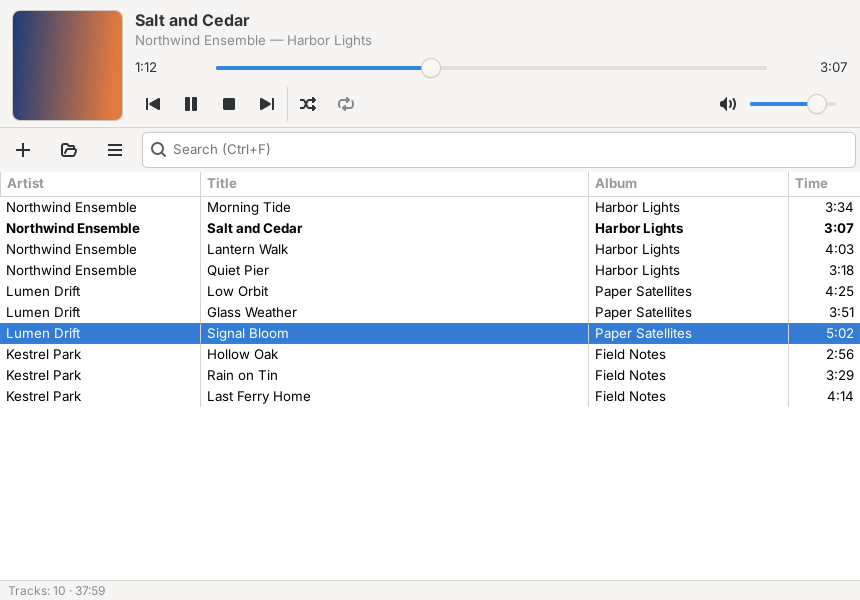

# haste

Music player to Linux inspired by AIMP — лёгкий нативный аудиоплеер на Rust + GTK4
для Debian 13 (Trixie). Работает в GNOME и XFCE. Главные цели — маленький бинарник
и минимум зависимостей. Интерфейс и иконка — оригинальные (только компоновка
«панель плеера + плейлист» в духе классических плееров).



## Возможности

* Воспроизведение MP3, FLAC, Ogg Vorbis, WAV/PCM, AAC/M4A (symphonia).
* Play/pause/stop, предыдущий/следующий (предыдущий после 3 с — в начало трека),
  перемотка слайдером и стрелками, громкость (кубическая кривая), shuffle
  (каждый трек один раз за цикл, история для «назад»), repeat: выкл / весь список / один трек.
* Плейлист на `GtkColumnView`: добавление файлов и папок (рекурсивно, в фоне),
  drag-and-drop, удаление выбранных, очистка, двойной клик/Enter — играть,
  поиск по нескольким словам, сортировка по колонкам (исполнитель, название,
  альбом, длительность). Проверено на 50 000 треков: окно открывается за ~0.13 с.
* Импорт/экспорт M3U/M3U8 (относительные пути, `file://`, `#EXTINF`, Latin-1-фолбэк).
* Теги и длительность в списке, обложка (встроенная или `cover.jpg`/`folder.jpg` рядом).
* Сессия в `~/.config/haste/`: плейлист с тегами (без повторного сканирования),
  текущий трек и позиция, громкость, режимы, сортировка, размер окна.
  Сохраняется при закрытии окна и по SIGTERM/SIGINT/SIGHUP.
* Интерфейс на английском или русском (по `LANG`), без gettext.
* `.desktop`, иконка, ассоциации MIME, AppStream metainfo, сборка `.deb`.

## Горячие клавиши

| Клавиша | Действие |
|---|---|
| Пробел | играть / пауза |
| ← / → (Shift — ×6) | перемотка на 5 с (30 с) |
| Ctrl+← / Ctrl+→ | предыдущий / следующий трек |
| Ctrl+O / Ctrl+Shift+O | добавить файлы / папку |
| Ctrl+I / Ctrl+S | импорт / экспорт плейлиста |
| Ctrl+F, Esc | поиск, сброс поиска |
| Delete | удалить выбранные |
| Ctrl+Q | выход |
| Медиаклавиши | Play/Pause/Stop/Next/Prev, пока окно в фокусе |

В GNOME медиаклавиши перехватывает `gsd-media-keys` и передаёт их плеерам по
MPRIS — для этого соберите с фичей `mpris` (см. ниже).

## Сборка на Debian 13 (Trixie)

Хватает пакетного Rust из Trixie (1.85):

```sh
sudo apt install build-essential pkg-config cargo rustc libgtk-4-dev libasound2-dev
git clone https://github.com/markzorg/haste && cd haste
cargo build --release
./target/release/haste                       # или с файлами/папками/плейлистами:
./target/release/haste ~/Music/Album some.flac list.m3u8
```

Запуск тестов: `cargo test`. Линтер: `cargo clippy --release`.

Звук идёт через ALSA. На Trixie с PipeWire нужен пакет `pipewire-alsa`
(ставится с GNOME по умолчанию), с PulseAudio — `libasound2-plugins`.

### Пакет .deb

```sh
sudo apt install dpkg-dev            # dpkg-deb, objdump уже есть в binutils
packaging/build-deb.sh               # → dist/haste_0.1.0_amd64.deb
sudo apt install ./dist/haste_0.1.0_amd64.deb
```

`Depends: libgtk-4-1 (>= 4.12), libasound2t64, libc6`. Кэши `.desktop`/иконок
обновляют dpkg-триггеры, maintainer-скрипты не нужны.

## Размер

Профиль `release`: `opt-level="z"`, `lto="fat"`, `codegen-units=1`,
`panic="abort"`, `strip=true`; флаги в `.cargo/config.toml`:
`-C target-cpu=x86-64 -Wl,--gc-sections -Wl,--as-needed`. Все крейты статически
внутри бинарника, динамически линкуются только системные библиотеки:

```
libgtk-4.so.1 libgio-2.0.so.0 libgobject-2.0.so.0 libglib-2.0.so.0
libasound.so.2 libgcc_s.so.1 libm.so.6 libc.so.6
```

| Сборка | Размер |
|---|---|
| `cargo build --release`, Rust 1.85 (Debian) + GNU ld | 1 563 136 Б (1.49 МиБ) |
| `scripts/size-report.sh`, stable 1.97 + LLD `--icf=all` | **1 449 608 Б (1.38 МиБ)** |
| `scripts/build-min.sh`, nightly `-Zbuild-std` + `panic=immediate-abort` | 1 019 568 Б (0.97 МиБ) |
| UPX `--best --lzma` (только для сравнения, не используется) | 935 036 Б |
| `.deb` (xz) | 568 480 Б |

`scripts/size-report.sh` собирает release, печатает размер, зависимости и
топ-10 крейтов по `cargo bloat` (`WITH_UPX=1` — сравнение с UPX):

```
 File  .text     Size Crate
 9.2%  36.7% 350.6KiB std
 2.7%  10.9% 103.9KiB symphonia_format_isomp4
 1.7%   7.0%  66.6KiB symphonia_core
 1.6%   6.3%  60.3KiB symphonia_metadata
 1.3%   5.2%  49.6KiB haste
 1.3%   5.0%  48.0KiB symphonia_codec_vorbis
 1.1%   4.6%  43.9KiB symphonia_format_ogg
 0.9%   3.7%  35.1KiB symphonia_bundle_mp3
 0.9%   3.5%  33.2KiB symphonia_bundle_flac
 0.8%   3.3%  31.6KiB symphonia_codec_aac
```

Что пробовали и почему так:

* `opt-level="s"` больше, чем `"z"` (+36 КБ).
* `--icf=all` (склейка одинаковых функций) −16 КБ, работает только с LLD —
  поэтому включается скриптом при Rust ≥ 1.90, а не в `.cargo/config.toml`.
* non-PIE (`-C relocation-model=static`) −57 КБ, но отключает ASLR для
  исполняемого файла — не включено.
* Примерно треть `std` — форматирование паник и символизация бэктрейсов
  (gimli/addr2line/miniz_oxide); на stable их не убрать, отсюда опциональная
  nightly-сборка (паники там завершают процесс молча).
* `regex-lite` (~31 КБ) тянет `symphonia-metadata` для разбора номеров
  треков/дат — без форка symphonia не убирается.
* Своё вместо крейтов: SPSC-буфер, ресемплер, xorshift, M3U, формат сессии,
  percent-decoding, обработка сигналов (одна FFI-функция из libglib).

## Архитектура

```
UI (главный цикл GTK) ──Command──▶ поток декодирования ──f32──▶ SPSC-кольцо ──▶ колбэк cpal (ALSA)
      ▲                                   │                                   без аллокаций и локов
      └──── mpsc + MainContext::invoke ◀──┘◀── потоки сканирования тегов (≤4)
```

* `audio/` — декодер symphonia → интерлив-стерео f32 → lock-free кольцевой буфер →
  колбэк cpal (громкость с плавной рампой, без щелчков на паузе). Seek/stop —
  без блокировок через маркер `flush_to`. Конец трека сообщается, только когда
  колбэк доиграл последний сэмпл. Устройство открывается на частоте файла;
  если не умеет — линейный ресемплер.
* `playlist/` — модель трека, сортировка, фильтр, порядок (shuffle/repeat), M3U.
* `library.rs` — теги и обход папок в фоне, результаты приходят по порядку пачками.
* `config.rs` — сессия (`session.conf` key=value + `playlist.tsv`).
* `ui/` — `gio::ListStore → SortListModel → FilterListModel → MultiSelection → ColumnView`.

Подробный план — в [docs/PLAN.md](docs/PLAN.md).

## Лицензия

MIT, см. [LICENSE](LICENSE).
